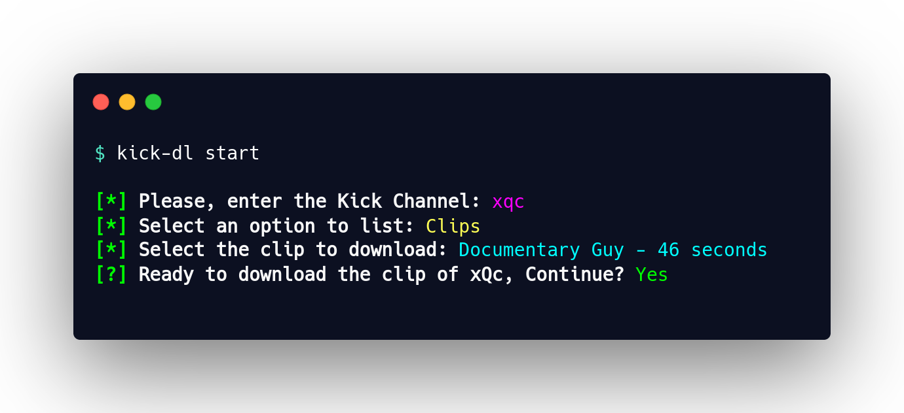

# :sparkles: Kick-DL :frog:


**Kick-DL is a command-line interface (CLI) tool designed for easily downloading VODs and Clips from kick.com**



> [!NOTE]
> This CLI tool is inspired by [Twitch-DL](https://github.com/ihabunek/twitch-dl) developed by [@ihabunek](https://github.com/ihabunek).

## Features :rocket:

- **Built-in FFmpeg**: It comes with FFmpeg integrated, allowing you to download multimedia content without needing to install FFmpeg on your system separately.
- **Multithreaded Downloads**: CLI is developed in Node.js, but it utilizes a compiled FFmpeg binary for quicker multithreaded downloads.
- **Global Installation**: Install it anywhere on your system and access it from any terminal with no hassle.
- **Cross-Platform Compatibility**: Works on Windows, macOS, and Linux operating systems.
- **VODs Downloads**: Download Videos on Demand (VODs) from Kick quickly with simple commands.
- **Clips Downloads**: Download Clips from Kick with ease and speed.
- **Customizable Options**: Adjust settings like format (mp4) and quality (1080p) to suit your needs.

## Support Us :sparkling_heart:

If you find this project useful and want us to keep improving it, please consider:

- [Star the Repo](https://github.com/juliogarciape/kick-dl): Give it a star on GitHub to help increase its visibility.

## Installation :package:

To install Kick-DL, run the following command in your terminal:

**using npm**:

```sh
npm install -g kick-dl
```

**using pnpm**:

```sh
pnpm add -g kick-dl
```

> [!NOTE]
> Kick-DL leverages Puppeteer to retrieve the .m3u8 paths for VODs and clips. As a result, you may encounter occasional issues, and no driver or Google Chrome configuration is necessary.
>
> This approach is due to the absence of a Public Kick API. Once one is made available, the CLI will be updated, and performance will be improved.

## Disclaimer :warning:

This project is not affiliated, associated, authorized, endorsed by, or in any way officially connected with `Kick` or any of its subsidiaries or its affiliates. The official Kick website can be found at [kick.com](https://kick.com). `Kick` as well as related names, marks, emblems and images are registered trademarks of their respective owners.

## Contributing :handshake:

We welcome contributions! If you have suggestions, improvements, or bug fixes, please submit a [Pull Request](https://github.com/juliogarciape/kick-dl/pulls) or open an [Issue](https://github.com/juliogarciape/kick-dl/issues).

## License :scroll:

Copyright :copyright: 2024 Julio Cesar Garcia

This project is licensed under the GNU General Public License v3.0. See the [LICENSE](LICENSE) file for more details.

## Contact :email:

Feel free to reach out with any questions or for help. You can contact me at [dev.juliogarciape@gmail.com](mailto:dev.juliogarciape@gmail.com)
